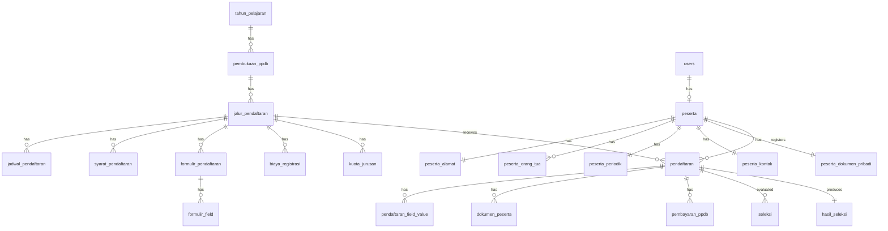

# MASTERPLAN PPDB 2026/2027

## Sistem Penerimaan Peserta Didik Baru — SMS-App

> **Dokumen Referensi:** `Laporan Teknis Rancangan Kebutuhan.md`
> **Tanggal:** 30 Maret 2026
> **Stack:** Laravel 12 · MySQL · Repository-Service Pattern · Yajra DataTables · Bootstrap 5

---

## 1. Arsitektur Pattern yang Digunakan

Seluruh modul PPDB **wajib** mengikuti pola yang sudah diterapkan pada modul `Master/Kurikulum`:

```
Controller → Service → Repository(Interface) → Model
     ↓            ↓
ResponseService  LogActivityService
```

**Konvensi file per entitas:**

| Layer | Path | Contoh |
|-------|------|--------|
| Model | `app/Models/{Cluster}/{Entity}.php` | `Models/Ppdb/PembukaanPpdb.php` |
| Repository Interface | `app/Repositories/{Cluster}/{Entity}RepositoryInterface.php` | `Repositories/Ppdb/PembukaanPpdbRepositoryInterface.php` |
| Repository | `app/Repositories/{Cluster}/{Entity}Repository.php` | `Repositories/Ppdb/PembukaanPpdbRepository.php` |
| Service | `app/Services/{Cluster}/{Entity}Service.php` | `Services/Ppdb/PembukaanPpdbService.php` |
| Controller | `app/Http/Controllers/{Cluster}/{Entity}Controller.php` | `Controllers/Ppdb/PembukaanPpdbController.php` |
| View | `resources/views/admin/{cluster}/{entity}/index.blade.php` | `views/admin/ppdb/pembukaan-ppdb/index.blade.php` |
| Migration | `database/migrations/yyyy_mm_dd_hhmmss_create_{table}_table.php` | |

**Binding** di `AppServiceProvider::register()` untuk setiap RepositoryInterface → Repository.

---

## 2. Struktur Folder per Cluster

### Cluster A — Identitas Peserta (Standar Dapodik)

```
app/
├── Models/Peserta/
│   ├── Peserta.php              # Data pribadi inti
│   ├── PesertaAlamat.php        # Alamat & koordinat
│   ├── PesertaOrangTua.php      # Ayah, Ibu, Wali
│   ├── PesertaPeriodik.php      # TB, BB, jarak, saudara
│   ├── PesertaKontak.php        # HP, email
│   └── PesertaDokumenPribadi.php # KIP, PKH, KK, KITAS, paspor
├── Repositories/Peserta/        # Interface + Implementation per model
├── Services/Peserta/
│   └── PesertaService.php       # Orchestrator CRUD multi-tabel
```

### Cluster B — Akademik (sudah ada sebagian)

```
app/
├── Models/Master/
│   ├── TahunPelajaran.php       # ✅ Sudah ada
│   ├── Semester.php             # ✅ Sudah ada
│   ├── Kurikulum.php            # ✅ Sudah ada
│   └── Jurusan.php              # BARU — untuk kuota jurusan
├── Repositories/Master/         # ✅ Sudah ada, tambah Jurusan
├── Services/Master/             # ✅ Sudah ada, tambah Jurusan
```

### Cluster C — Konfigurasi PPDB

```
app/
├── Models/Ppdb/
│   ├── PembukaanPpdb.php
│   ├── JalurPendaftaran.php
│   ├── JadwalPendaftaran.php
│   ├── SyaratPendaftaran.php
│   ├── FormulirPendaftaran.php
│   ├── FormulirField.php
│   ├── BiayaRegistrasi.php
│   ├── KuotaJurusan.php
│   └── TemplateDokumen.php      # Pengumuman & kartu peserta
├── Repositories/Ppdb/
├── Services/Ppdb/
```

### Cluster D — Transaksional

```
app/
├── Models/Transaksi/
│   ├── Pendaftaran.php
│   ├── PendaftaranFieldValue.php
│   ├── DokumenPeserta.php
│   ├── PembayaranPpdb.php
│   ├── Seleksi.php
│   └── HasilSeleksi.php
├── Repositories/Transaksi/
├── Services/Transaksi/
│   ├── PendaftaranService.php    # Orchestrator alur daftar
│   ├── PembayaranService.php     # Integrasi payment gateway
│   └── SeleksiService.php        # Kalkulasi nilai & ranking
```

### Cluster E — Notifikasi & Audit

```
app/
├── Models/
│   ├── Notifikasi.php
│   └── LogActivity.php           # ✅ Sudah ada
├── Services/
│   ├── NotifikasiService.php
│   └── LogActivityService.php    # ✅ Sudah ada
```

### Views (Admin Panel)

```
resources/views/admin/
├── ppdb/
│   ├── pembukaan-ppdb/index.blade.php
│   ├── jalur-pendaftaran/index.blade.php
│   ├── jadwal/index.blade.php
│   ├── syarat/index.blade.php
│   ├── formulir/index.blade.php
│   ├── biaya/index.blade.php
│   ├── kuota-jurusan/index.blade.php
│   └── template-dokumen/index.blade.php
├── pendaftaran/
│   ├── index.blade.php           # List & verifikasi
│   ├── detail.blade.php          # Detail pendaftaran
│   └── dokumen/index.blade.php
├── seleksi/
│   ├── index.blade.php
│   ├── penilaian.blade.php
│   └── hasil.blade.php
├── pembayaran/
│   └── index.blade.php
├── peserta/
│   ├── index.blade.php
│   └── detail.blade.php          # Multi-tab: Pribadi, Alamat, Ortu, Periodik
└── notifikasi/
    └── index.blade.php
```

---

## 3. Daftar Tabel & Relasi

### 3.1 Pemecahan Tabel Peserta (Standar Dapodik)

> **PENTING:** Dokumen asal menginstruksikan pemecahan tabel peserta sesuai poin 1.1 Standar Dapodik.

| # | Tabel | Kolom Utama | Relasi |
|---|-------|-------------|--------|
| 1 | `peserta` | id, user_id(FK→users), nisn, nik, nama_lengkap, jenis_kelamin, tempat_lahir, tanggal_lahir, agama, kebutuhan_khusus, no_kk, foto | `belongsTo(User)` |
| 2 | `peserta_alamat` | id, peserta_id(FK), alamat, desa_kelurahan, kecamatan, kabupaten_kota, provinsi, rt, rw, dusun, kode_pos, lintang, bujur | `belongsTo(Peserta)` |
| 3 | `peserta_orang_tua` | id, peserta_id(FK), tipe(ayah/ibu/wali), nama, nik, pekerjaan, penghasilan, pendidikan, kebutuhan_khusus, no_hp | `belongsTo(Peserta)` — 3 baris per peserta |
| 4 | `peserta_periodik` | id, peserta_id(FK), tinggi_badan, berat_badan, lingkar_kepala, jarak_rumah, waktu_tempuh, jumlah_saudara, tahun_pelajaran_id(FK) | `belongsTo(Peserta)` |
| 5 | `peserta_kontak` | id, peserta_id(FK), no_hp, email | `belongsTo(Peserta)` |
| 6 | `peserta_dokumen_pribadi` | id, peserta_id(FK), no_kip, no_pkh, no_kitas, no_paspor | `belongsTo(Peserta)` |

### 3.2 Tabel Konfigurasi PPDB

| # | Tabel | Relasi Utama |
|---|-------|-------------|
| 7 | `pembukaan_ppdb` | `belongsTo(TahunPelajaran)` |
| 8 | `jalur_pendaftaran` | `belongsTo(PembukaanPpdb)` |
| 9 | `jadwal_pendaftaran` | `belongsTo(JalurPendaftaran)` |
| 10 | `syarat_pendaftaran` | `belongsTo(JalurPendaftaran)`, `belongsTo(TahunPelajaran)` |
| 11 | `formulir_pendaftaran` | `belongsTo(JalurPendaftaran)`, `belongsTo(TahunPelajaran)` |
| 12 | `formulir_field` | `belongsTo(FormulirPendaftaran)` |
| 13 | `biaya_registrasi` | `belongsTo(JalurPendaftaran)`, `belongsTo(TahunPelajaran)` |
| 14 | `kuota_jurusan` | `belongsTo(TahunPelajaran)`, `belongsTo(JalurPendaftaran)`, `belongsTo(Jurusan)` |
| 15 | `template_dokumen` | Standalone, ENUM tipe: pengumuman/kartu |

### 3.3 Tabel Transaksional

| # | Tabel | Relasi Utama |
|---|-------|-------------|
| 16 | `pendaftaran` | `belongsTo(Peserta)`, `belongsTo(JalurPendaftaran)`, `belongsTo(TahunPelajaran)` |
| 17 | `pendaftaran_field_value` | `belongsTo(Pendaftaran)`, `belongsTo(FormulirField)` |
| 18 | `dokumen_peserta` | `belongsTo(Pendaftaran)`, `belongsTo(SyaratPendaftaran)` |
| 19 | `pembayaran_ppdb` | `belongsTo(Pendaftaran)`, `belongsTo(BiayaRegistrasi)` |
| 20 | `seleksi` | `belongsTo(Pendaftaran)`, `belongsTo(User)` as reviewer |
| 21 | `hasil_seleksi` | `belongsTo(Pendaftaran)`, `belongsTo(User)` as reviewer |

### 3.4 Tabel Pendukung

| # | Tabel | Keterangan |
|---|-------|-----------|
| 22 | `jurusan` | **BARU** — Master jurusan/program keahlian |
| 23 | `notifikasi` | `belongsTo(User)`, multi-channel |
| 24 | `log_activities` | ✅ Sudah ada — tetap gunakan yang existing |

### 3.5 Diagram Relasi Utama



---

## 4. Alur Kerja Model AI per Tahapan

> **TIP:** Strategi ini dirancang untuk memaksimalkan kuota dengan mengalokasikan model yang tepat untuk jenis pekerjaan yang sesuai.

| Tahapan | Pekerjaan | Model Rekomendasi | Alasan |
|---------|-----------|-------------------|--------|
| **Fase 1: Database** | Migration, seeder, indexing | **Gemini 2.5 Pro** | Repetitif berbasis template, token murah, output besar |
| **Fase 2: Model & Repository** | Model Eloquent, Interface, Repository | **Gemini 2.5 Pro** | Boilerplate pattern seragam, volume file banyak |
| **Fase 3: Service Logic** | Business logic, validasi, orchestrator multi-tabel | **Claude Sonnet 4** | Logika bisnis butuh pemahaman konteks mendalam |
| **Fase 4: Controller** | CRUD controller, DataTables, RBAC permission | **Gemini 2.5 Pro** | Pattern sudah jelas dari KurikulumController |
| **Fase 5: UI/UX (Views)** | Blade templates, modals, form multi-step, JS | **Claude Sonnet 4** | UI butuh kreativitas + konsistensi pola existing |
| **Fase 6: Payment Gateway** | Midtrans/Xendit, webhook, security | **Claude Opus 4** | Keamanan kritis, edge case, idempotency |
| **Fase 7: Debugging** | Bug fixing, edge cases, optimasi | **Claude Sonnet 4** | Pemahaman multi-file dan tracing error |
| **Fase 8: Testing** | PHPUnit, factory, seeder | **Gemini 2.5 Pro** | Pola test repetitif, volume besar |

### Ringkasan Distribusi Kuota

| Model | Proporsi | Fase |
|-------|----------|------|
| **Gemini 2.5 Pro** | ~45% | Database, Model/Repo, Controller, Testing |
| **Claude Sonnet 4** | ~40% | Service Logic, UI/UX, Debugging |
| **Claude Opus 4** | ~15% | Payment Gateway, Security-critical |

---

## 5. Roadmap Milestone

### Milestone 1 — Foundation & Database (2-3 hari)

- [ ] Migration tabel `peserta` + 5 tabel pecahan Dapodik
- [ ] Migration tabel `jurusan`
- [ ] Migration 9 tabel konfigurasi PPDB
- [ ] Migration 6 tabel transaksional
- [ ] Migration tabel `notifikasi`
- [ ] Composite index pada kolom filter utama
- [ ] Seeder data contoh

### Milestone 2 — Model & Repository Layer (2 hari)

- [ ] Models Cluster A (Peserta: 6 model)
- [ ] Models Cluster C (Ppdb: 9 model)
- [ ] Models Cluster D (Transaksi: 6 model)
- [ ] Model Jurusan dan Notifikasi
- [ ] Eloquent relationships
- [ ] RepositoryInterface + Repository per model
- [ ] Register bindings di AppServiceProvider

### Milestone 3 — Konfigurasi PPDB Admin (3-4 hari)

- [ ] Service+Controller+View: PembukaanPpdb, JalurPendaftaran
- [ ] Service+Controller+View: JadwalPendaftaran, SyaratPendaftaran
- [ ] Service+Controller+View: BiayaRegistrasi, KuotaJurusan
- [ ] Service+Controller+View: TemplateDokumen (upload PDF)
- [ ] Routes prefix `admin.ppdb.*`
- [ ] Sync permissions

### Milestone 4 — Formulir Builder Admin (2-3 hari)

- [ ] Service+Controller+View: FormulirPendaftaran & FormulirField
- [ ] Field types: text, number, date, select, file, textarea
- [ ] Mapping field statis ke kolom Dapodik
- [ ] Preview formulir dinamis

### Milestone 5 — Manajemen Peserta Admin (2-3 hari)

- [ ] PesertaService orchestrator CRUD multi-tabel
- [ ] Controller+View: list peserta DataTable
- [ ] Detail peserta multi-tab (Pribadi, Alamat, Ortu, Periodik, Kontak, Dokumen)
- [ ] Import/Export CSV format Dapodik
- [ ] Validasi NIK/NISN unik

### Milestone 6 — Alur Pendaftaran (3-4 hari)

- [ ] PendaftaranService: create, generate no_pendaftaran
- [ ] Pengisian data statis + render dynamic form
- [ ] Upload dokumen + validasi file
- [ ] Status transition: draft → submit → verifikasi
- [ ] View admin: verifikasi data & dokumen

### Milestone 7 — Payment Gateway (3-4 hari)

- [ ] Install & config Midtrans (`midtrans/midtrans-php`)
- [ ] PembayaranService: snap token, callback handling
- [ ] Webhook endpoint
- [ ] Status: pending → paid/expired/failed
- [ ] Idempotency & security

### Milestone 8 — Seleksi & Pengumuman (2-3 hari)

- [ ] SeleksiService: input nilai, kalkulasi (bobot × nilai)
- [ ] Auto-ranking per jalur
- [ ] Generate PDF pengumuman & kartu peserta
- [ ] Status: verifikasi → lulus/tidak → daftar_ulang → siswa_tetap

### Milestone 9 — Notifikasi Multi-Channel (1-2 hari)

- [ ] NotifikasiService: email (Laravel Mail), in-app
- [ ] Template notifikasi per event
- [ ] Queue-based sending
- [ ] Log status pengiriman

### Milestone 10 — Audit, Polish & Testing (2-3 hari)

- [ ] LogActivityService di seluruh controller PPDB
- [ ] Optimasi query (composite index, eager loading)
- [ ] PHPUnit service layer
- [ ] Export CSV standar Kemdikbud
- [ ] Review keamanan

---

## 6. Konvensi Route

```php
// routes/web.php — Tambahan PPDB
Route::prefix('admin')->name('admin.')->middleware(['auth', 'permission'])->group(function () {
    // PPDB Konfigurasi
    Route::prefix('ppdb')->name('ppdb.')->group(function () {
        Route::get('pembukaan/list', [PembukaanPpdbController::class, 'list'])->name('pembukaan.list');
        Route::post('pembukaan/{id}/toggle-status', [PembukaanPpdbController::class, 'toggleStatus'])->name('pembukaan.toggle');
        Route::resource('pembukaan', PembukaanPpdbController::class)->except(['create', 'edit']);
        // ... pola serupa untuk jalur, jadwal, syarat, formulir, biaya, kuota, template
    });

    // Pendaftaran & Transaksi
    Route::prefix('pendaftaran')->name('pendaftaran.')->group(function () {
        Route::get('list', [PendaftaranController::class, 'list'])->name('list');
        Route::post('{id}/verifikasi', [PendaftaranController::class, 'verifikasi'])->name('verifikasi');
        Route::resource('/', PendaftaranController::class)->except(['create', 'edit']);
    });

    // Seleksi, Pembayaran, Peserta — pola serupa
});

// Webhook (tanpa auth)
Route::post('webhook/midtrans', [WebhookController::class, 'midtrans'])->name('webhook.midtrans');
```

---

## 7. Checklist Permission RBAC

```
admin.ppdb.pembukaan.index|store|show|update|destroy|toggle
admin.ppdb.jalur.index|store|show|update|destroy
admin.ppdb.jadwal.index|store|show|update|destroy
admin.ppdb.syarat.index|store|show|update|destroy
admin.ppdb.formulir.index|store|show|update|destroy
admin.ppdb.biaya.index|store|show|update|destroy
admin.ppdb.kuota.index|store|show|update|destroy
admin.ppdb.template.index|store|show|update|destroy
admin.pendaftaran.index|show|verifikasi
admin.seleksi.index|store|show|update
admin.seleksi.hasil.index|store
admin.pembayaran.index|show|konfirmasi
admin.peserta.index|store|show|update|destroy|export
admin.notifikasi.index|store
```

---

## 8. Dependency Baru

| Package | Kegunaan | Install |
|---------|----------|---------|
| `midtrans/midtrans-php` | Payment gateway | `composer require midtrans/midtrans-php` |
| `barryvdh/laravel-dompdf` | Generate PDF | `composer require barryvdh/laravel-dompdf` |
| `maatwebsite/excel` | Import/Export CSV | `composer require maatwebsite/excel` |

---

## 9. Open Questions

> **PERLU KEPUTUSAN** sebelum eksekusi dimulai:

1. **Payment Gateway:** Midtrans atau Xendit? Atau keduanya?
2. **Portal Peserta:** Guard `peserta` terpisah atau guard `web` yang sama?
3. **Multi-jalur:** Bolehkah 1 peserta daftar di >1 jalur dalam 1 gelombang?
4. **SMS Notification:** Gateway apa? (Twilio, WA API, Zenziva?)
5. **Integrasi Dapodik API:** Validasi NISN/NIK via API langsung atau format-only dulu?
6. **Urutan eksekusi:** Setuju dengan roadmap 10 milestone di atas?
