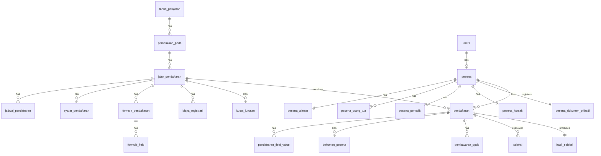
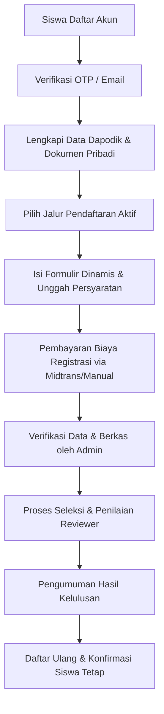

# Ringkasan Sistem PPDB — SMS-App

Dokumen ini berisi rangkuman menyeluruh mengenai arsitektur, teknologi, struktur data, dan alur kerja Sistem Penerimaan Peserta Didik Baru (PPDB) Tahun Pelajaran 2026/2027 pada proyek ini.

---

## 🛠️ 1. Tech Stack (Teknologi Utama)

Sistem ini dikembangkan menggunakan kombinasi teknologi berikut:
* **Framework Backend:** Laravel 12
* **Database:** SQLite (menggunakan database berkas `marifat` secara lokal) / MySQL
* **Frontend:** Laravel Blade Templates, Bootstrap 5, dan Yajra DataTables (untuk kebutuhan pencarian dan pagination interaktif pada data tabular di Admin Panel)
* **Paket/Libraries Tambahan:**
  * `midtrans/midtrans-php` — Integrasi Payment Gateway (Midtrans Snap & Webhook callback)
  * `barryvdh/laravel-dompdf` — Pembuatan berkas PDF (kartu peserta & surat pengumuman)
  * `maatwebsite/excel` — Ekspor/Impor data dengan format CSV/Excel (khususnya untuk standar Dapodik)

---

## 🏗️ 2. Pola Arsitektur (Design Pattern)

Aplikasi ini menggunakan pendekatan **Repository-Service Pattern** secara konsisten untuk memisahkan logika bisnis dari database, dengan tujuan mempermudah pengujian dan menjaga modularitas kode.

```
Controller ➔ Service (Bisnis Logika) ➔ Repository Interface ➔ Repository ➔ Eloquent Model
```

Layanan pembantu lintas modul (cross-cutting concerns):
* **`ResponseService`:** Menyeragamkan format response API / AJAX.
* **`LogActivityService`:** Mencatat jejak riwayat aktivitas (Audit Log) demi kepatuhan terhadap UU Pelindungan Data Pribadi (UU PDP).

---

## 🗄️ 3. Pembagian Cluster Database (Normalisasi Dapodik)

Struktur tabel di dalam database dipecah ke dalam beberapa cluster logis untuk memisahkan data statis Dapodik dari data transaksional pendaftaran:



### Cluster A — Identitas Peserta (Standar Dapodik)
Tabel ini digunakan untuk menampung biodata lengkap calon peserta didik secara rinci:
* `peserta` (NISN, NIK, nama lengkap, jenis kelamin, tempat/tanggal lahir, agama, dll)
* `peserta_alamat` (Alamat rumah lengkap beserta titik koordinat lintang & bujur)
* `peserta_orang_tua` (Data Ayah, Ibu, dan Wali)
* `peserta_periodik` (Tinggi badan, berat badan, jarak dan waktu tempuh ke sekolah, jumlah saudara)
* `peserta_kontak` (Nomor HP & Email aktif)
* `peserta_dokumen_pribadi` (Nomor KIP, PKH, kartu jaminan sosial, nomor paspor/KITAS)

### Cluster B & C — Konfigurasi & Master PPDB
Tabel pendukung untuk memfasilitasi administrasi dan konfigurasi PPDB dinamis:
* Master Akademik: `tahun_pelajaran`, `semester`, `jurusan`
* Pengaturan PPDB: `pembukaan_ppdb` (gelombang), `jalur_pendaftaran`, `jadwal_pendaftaran`, `syarat_pendaftaran` (syarat upload), `biaya_registrasi`, `kuota_jurusan` (kuota per jurusan per jalur), `template_dokumen` (PDF kartu/pengumuman)
* Formulir Dinamis: `formulir_pendaftaran` dan `formulir_field` (mendukung pembuat form kustom)

### Cluster D & E — Transaksional & Audit
* `pendaftaran` (Transaksi registrasi jalur masuk dan penomoran unik peserta)
* `pendaftaran_field_value` (Menampung jawaban isian formulir dinamis)
* `dokumen_peserta` (Daftar file unggahan bukti syarat pendaftaran beserta status verifikasi)
* `pembayaran_ppdb` (Log transaksi biaya pendaftaran, status Midtrans/manual)
* `seleksi` & `hasil_seleksi` (Penilaian juri/reviewer dan status ranking final kelulusan)
* `notifikasi` (Riwayat pengiriman notifikasi email/in-app)
* `log_activities` (Catatan audit log sistem)

---

## 🚀 4. Fitur-Fitur Utama Aplikasi

1. **RBAC (Role-Based Access Control):** 
   Pengelolaan role admin, operator, dan reviewer secara terpusat untuk membatasi akses menu konfigurasi, verifikasi berkas, dan penilaian.
2. **Formulir Dinamis (Dynamic Form Builder):**
   Memungkinkan admin mendesain field isian tambahan per jalur masuk (misalnya: file portofolio, isian prestasi akademik) dengan validasi tipe data kustom tanpa perlu memodifikasi database/kodingan.
3. **Integrasi Midtrans Snap & Webhook:**
   Pembayaran biaya pendaftaran otomatis menggunakan Midtrans. Dilengkapi fallback konfirmasi manual jika terjadi gangguan atau pembayaran offline.
4. **Verifikasi Berkas Calon Siswa:**
   Halaman khusus bagi operator/admin untuk memverifikasi dokumen syarat pendaftaran (`valid` / `invalid` / `pending`).
5. **Penilaian & Auto-Ranking:**
   Fitur penilaian multi-tahap oleh reviewer yang akan dikalkulasikan secara otomatis berdasarkan bobot. Sistem akan menghasilkan ranking pendaftar secara real-time sesuai batas kuota masing-masing jalur pendaftaran.
6. **Ekspor-Impor CSV Dapodik:**
   Kemudahan pengolahan data pendaftar dengan fitur ekspor dan impor CSV berstandar Dapodik Kemendikbud.

---

## 🔄 5. Alur Kerja Pendaftaran Siswa (End-to-End)


